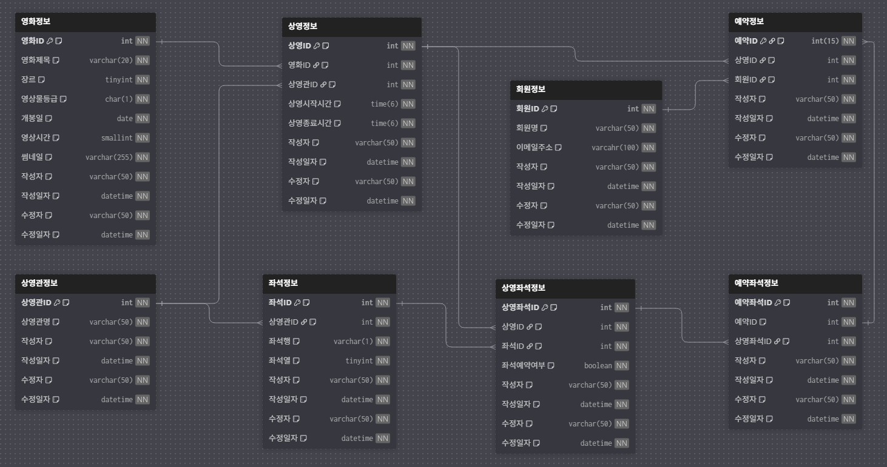

# 영화 예매 시스템 (Movie Reservation System)

## 프로젝트 개요
영화 예매 시스템은 사용자가 영화 좌석을 예매하고 관리할수 있는 REST API 기반 서비스 입니다.

## 기술 스택
- Spring Boot 3.4.11
- Spring Data JPA
- Java 17
- Gradle
- MySQL 8.0
- Docker
- Redis
- K6
- Junit5
- Prometheus
- IntelliJ Http Request

## 아키텍쳐(Hexagonal Architecture)
`헥사고날 아키텍처`를 기반으로 한 멀티모듈 구성입니다.

#### domain
- `도메인` 모듈은 다른 모듈에 의존하지 않습니다.
- 도메인의 핵심 로직을 책임지는 엔티티, 예외, 변환기 등의 요소를 포함합니다.
- 비즈니스 로직의 중심으로, 외부 변화에 의존하지 않도록 설계하였습니다.

#### application
- `애플리케이션`모듈은 `도메인`모듈에 의존합니다.
- Inbound Port: 컨트롤러에서 DTO로 데이터를 주고 받을 때 호출할 서비스 포트를 제공합니다.
- Outbound Port: DB와 통신하기 위해 서비스 계층에서 호출할 리포지토리 포트를 정의합니다.

#### infrastructure
- `인프라스트럭쳐`모듈은 `애플리케이션`모듈과 `도메인`모듈에 의존합니다.
- 외부 시스템 및 DB와의 연결을 담당합니다.
- adapter: 저장소와 상호작용하기 위해 리포지토리 포트를 구현합니다.

## 테이블 구조

테이블 : 영화, 상영관, 상영정보, 좌석, 상영좌석, 예매, 예매좌석, 회원

>- 공통코드는 테이블을 별도로 생성하지 않고, ENUM으로 관리(영상물 등급, 장르)

# 📊 성능 테스트
### 1. 성능 테스트 개요
1500명 사용자의 최대 부하를 견딜 수 있는지 5분 동안 테스트
- **DAU**:** 1500명
- **목적:** 하루 **1500명 사용자가 피트 트래픽** 상황에서 API 성능 검증
- **부하 패턴:** 2분동안 1500명까지 증가 → 2분 유지 → 1분 종료
- **성능 기준:** **상위 95% 요청이 응답 시간 200ms 이하, 실패율 1% 미만**
- **테스트 대상**
      - 검색 조회: `/api/v1/movies?title='검색어'&genre='장르명'`

### 2. 테스트 쿼리
> Entity Graph를 적용하여 Fetch Join을 적용한 목록 조회 API

#### 영화 목록 조회(검색조건 포함)
```sql
Hibernate: 
    select
        m1_0.id,
        m1_0.content_rating,
        m1_0.created_at,
        m1_0.created_by,
        m1_0.genre,
        m1_0.modified_at,
        m1_0.modified_by,
        m1_0.release_date,
        m1_0.runtime_minutes,
        s1_0.movie_id,
        s1_0.id,
        s1_0.created_at,
        s1_0.created_by,
        s1_0.end_time,
        s1_0.modified_at,
        s1_0.modified_by,
        s1_0.start_time,
        s1_0.theater_id,
        t1_0.id,
        t1_0.created_at,
        t1_0.created_by,
        t1_0.modified_at,
        t1_0.modified_by,
        t1_0.name,
        m1_0.thumbnail_url,
        m1_0.title 
    from
        movie m1_0 
    left join
        screening s1_0 
            on m1_0.id=s1_0.movie_id 
    left join
        theater t1_0 
            on t1_0.id=s1_0.theater_id 
    where
        m1_0.title like ? escape '!' 
        and m1_0.genre=? 
    order by
        m1_0.release_date desc

```
## 테스트 케이스
  - **케이스 1**: INDEX 적용❌, Cache(Redis) 적용❌
  - **케이스 2**: INDEX 적용 ⭕, Cache(Redis) 적용❌
  - **케이스 3**: INDEX 적용 ⭕, Cache(Redis) 적용⭕

## 성능 테스트 결과 요약
| 항목       | 케이스 1 | 케이스 2 | 케이스 3 | 비고          |
| -------- | ---------------- | ---------------- | ---------------- | ----------- |
| 조건| Index(x), Cache(x)            | Index(o), Cache(x)             | Index(o), Cache(o)             |     |
| 평균응답(ms) | 356.9            | 23.0             | 7.3              | 48.6배 향상    |
| p95(ms)  | 1700             | 99.8             | 19.6             | 약 98.8 % 개선 |
| 실패율      | < 0.01 %         | < 0.01 %         | < 0.01 %         | 모두 양호       |
| 체감효과     | 매우 느림            | DB 최적화 완료        | 실시간 응답 수준        |             |

  - 인덱스만으로도 DB 풀스캔 → 인덱스 탐색 전환으로 93 % 이상 응답 속도 단축.
  - Redis 캐시를 추가하면 DB 쿼리 자체를 생략하여 평균 7 ms 대의 초고속 응답 달성(98.8% 개선).


### 1. INDEX 적용❌, Cache(Redis) 적용❌

| id  | select_type | table | partitions | type   | possible_keys | key     | key_len | ref                          | rows | filtered | Extra                                        |
| --- | ----------- | ----- | ---------- | ------ | ------------- | ------- | ------- | ---------------------------- | ---- | -------- | -------------------------------------------- |
| 1   | SIMPLE      | m1_0  | NULL       | ALL    | NULL          | NULL    | NULL    | NULL                         | 501  | 1.11     | Using where; Using temporary; Using filesort |
| 1   | SIMPLE      | s1_0  | NULL       | ALL    | NULL          | NULL    | NULL    | NULL                         | 1501 | 100      | Using where; Using join buffer (hash join)   |
| 1   | SIMPLE      | t1_0  | NULL       | eq_ref | PRIMARY       | PRIMARY | 4       | dev_database.s1_0.theater_id | 1    | 100      | NULL                                         |

- **`movie` 테이블**: 인덱스를 사용하지 않고 **Full Table Scan (`ALL`)**  발생
- **`screening` 테이블**: `movie_id` 컬럼에 적절한 인덱스가 없어 **Full Table Scan (`ALL`)** 발생
- **`theater` 테이블**: 기본 키(`PRIMARY KEY`)를 사용한 PK 기반 단일 조회

#### 부하 테스트 결과
  .png)
  - VU: 1500 
  - 평균 응답 시간: 356.89ms
  - p(95) 응답 시간: 1.7s (목표 200ms 초과 ❌)
  - 실패율 (http_req_failed): 0.01% 미만
  - 최대 응답 시간: 2.62s (긴 응답 발생 ❌)


### 2. INDEX 적용 ⭕, Cache(Redis) 적용❌
#### 적용한 인덱스 DDL
```jsx
-- 1. genre, title 순으로 인덱스 생성
CREATE INDEX idx_genre_title ON dev_database.movie (genre, title);

-- 모든 경우에 screening 테이블의 풀 스캔을 막기 위해 movie_id에 인덱스 생성
CREATE INDEX idx_screening_movie_id ON screening (movie_id);
```

| id  | select_type | table | partitions | type   | possible_keys          | key                    | key_len | ref                          | rows | filtered | Extra                                 |
| --- | ----------- | ----- | ---------- | ------ | ---------------------- | ---------------------- | ------- | ---------------------------- | ---- | -------- | ------------------------------------- |
| 1   | SIMPLE      | m1_0  | NULL       | ref    | idx_genre_title        | idx_genre_title        | 1       | const                        | 104  | 11.11    | Using index condition; Using filesort |
| 1   | SIMPLE      | s1_0  | NULL       | ref    | idx_screening_movie_id | idx_screening_movie_id | 4       | dev_database.m1_0.id         | 2    | 100      | NULL                                  |
| 1   | SIMPLE      | t1_0  | NULL       | eq_ref | PRIMARY                | PRIMARY                | 4       | dev_database.s1_0.theater_id | 1    | 100      | NULL                                  |

- **`movie` 테이블**: genre + title 인덱스 사용, 501 -> 104건 조회 (✅ 최적화됨)
- **`screening` 테이블**: movie_id 인덱스 사용, 1501 -> 2건 조회 (✅ 최적화됨)
- **`theater` 테이블**: 기본키 검색, 1건 조회 (기존 그대로)

#### 부하 테스트 결과
  .png)
  - VU: 1500 
  - 평균 응답 시간: 23.05ms
  - p(95) 응답 시간: 99.78ms (✅ 목표 200ms 미만)
  - 실패율 (http_req_failed): 0.01% 미만 (✅ 목표 0.01% 미만)
  - 최대 응답 시간: 2.13s (긴 응답 발생 ❌)


## 3. INDEX 적용 ⭕, Cache(Redis) 적용⭕
> Redis 분산락 적용
#### 부하 테스트 결과
  .png)
  - VU: 1500 
  - 평균 응답 시간: 7.34ms
  - p(95) 응답 시간: 19.61ms (✅ 목표 200ms 미만)
  - 실패율 (http_req_failed): 0.01% 미만 (✅ 목표 0.01% 미만)
  - 최대 응답 시간: 285.06ms (✅ 빠른 응답)


